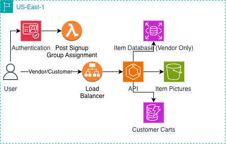

# AWS-Projects

## Overview
This repo contains a series of projects created to learn how to use the AWS CDK and other AWS technologies

### Store API (Under Construction)

#### Tech Stack:

API: C# and ASP.NET

Group Assignment Lambda: Typescript

Item Database: MySQL

Customer Carts: DynamoDB

### Banking App

#### Tech Stack:

CDK Stack: TypeScript

Bank Event Generator: TypeScript

Bank Event Processor: Go

Transaction Ledger: Amazon RDS MySQL

Account Status: Amazon Dynamodb

### HelloWorldCDK

A project to learn the basics of creating CDK stacks and lambda handlers

#### Tech Stack:

CDK Stack: TypeScript

Lambda: Go, Docker

### Future Project Ideas

* WebAPI
* EC2 and High Performance Computing
* Disaster Recovery with Chaos Monkey
* Container Management Project
* Multi-Stack Project
* CI/CD
